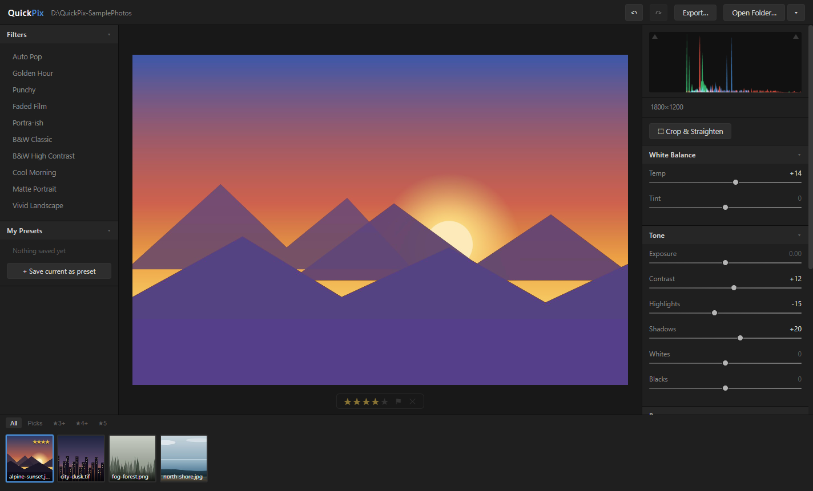
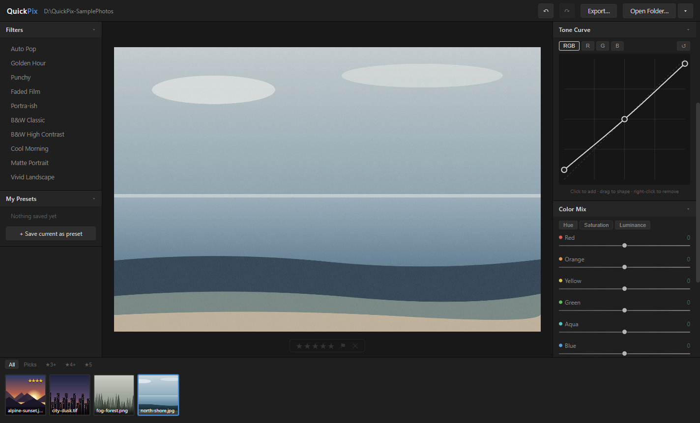
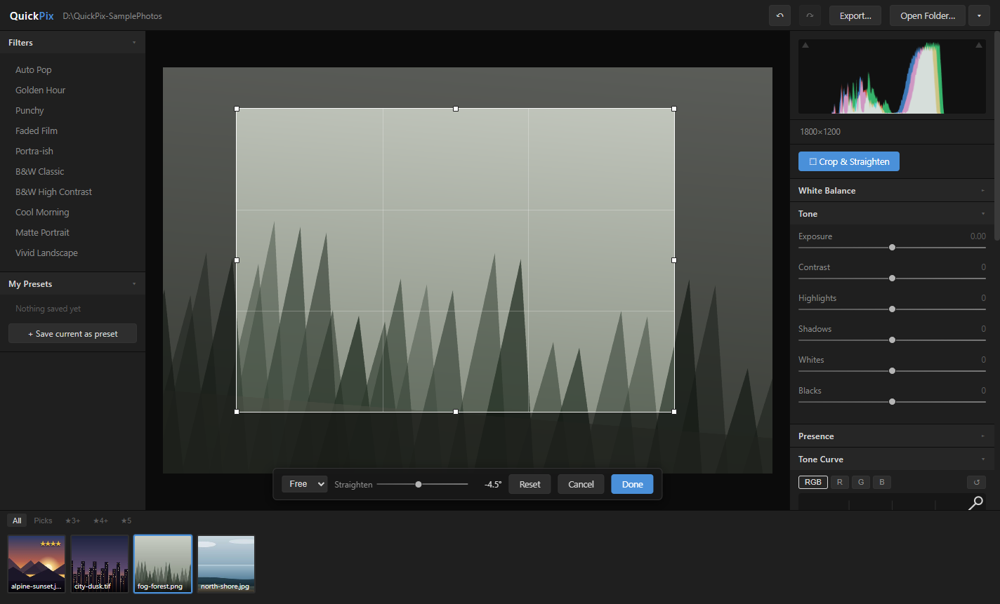
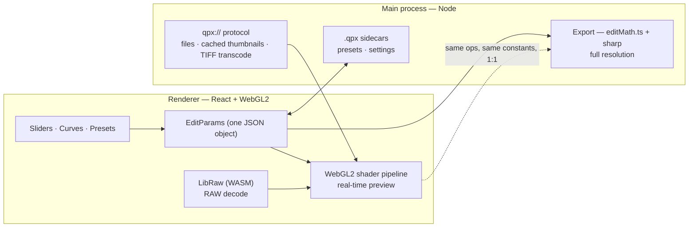

<p align="center">
  
</p>

<h1 align="center">QuickPix</h1>

<p align="center">
  <strong>A free & open-source Lightroom-style photo editor for Windows.</strong><br/>
  Quick, subtle, non-destructive touch-ups — open a folder, drag some sliders, apply a filter, export.<br/>
  Your original files are never modified.
</p>

<p align="center">
  <a href="https://github.com/goldwav/quickpix/actions/workflows/ci.yml"></a>
  <a href="https://github.com/goldwav/quickpix/releases/latest"></a>
  
  
</p>



## Download

Grab the installer from the [latest release](https://github.com/goldwav/quickpix/releases/latest).
The app auto-updates from GitHub Releases. (The installer is not code-signed yet — Windows
SmartScreen will warn; click **More info → Run anyway**.)

## Features

- **Real-time GPU editing** — every slider is a WebGL2 shader pass: exposure, contrast, highlights/shadows, whites/blacks, temp/tint, vibrance, saturation, clarity, sharpen, vignette, grain
- **Tone curve** — master + per-channel RGB, monotone-cubic spline (no banding overshoot)
- **Color Mix** — 8-band HSL mixer (hue / saturation / luminance per color), neutral-protected
- **Split toning** — independent shadow & highlight tints with balance
- **Crop & straighten** — aspect presets, rule-of-thirds grid, ±45° with auto-fill (no blank corners)
- **RAW support** — CR2, CR3, NEF, ARW, DNG, RAF, ORF, RW2, PEF via LibRaw compiled to WASM
- **Non-destructive by construction** — edits live in `photo.jpg.qpx` JSON sidecars; delete the sidecar to fully revert
- **Filters** — 10 built-in subtle looks, live hover preview, save your own presets
- **Culling** — star ratings & pick/reject flags with filmstrip filtering
- **Export** — JPEG/PNG/WebP at full resolution with *exactly* the same math as the preview; multi-select batch export with progress
- **Quality of life** — undo/redo, copy/paste settings, histogram with clipping warnings, EXIF strip, session restore, drag & drop, 1:1 zoom/pan, before/after compare

| Tone curve & Color Mix | Crop & straighten |
| --- | --- |
|  |  |

## How it works



Three design decisions carry the whole app:

1. **`EditParams` is a plain JSON object and the single source of truth.** Sliders write it, the
   GPU renders it, presets are named copies of it, undo history is an array of it, sidecars
   serialize it, and export replays it. Every feature that would normally be hard — undo/redo,
   copy/paste settings, live preset preview — falls out of this for free.
2. **Preview renders on the GPU, export on the CPU — as deliberate 1:1 mirrors.**
   [`adjust.frag`](src/renderer/src/gl/shaders/adjust.frag) and
   [`editMath.ts`](src/shared/editMath.ts) implement the same operations with the same constants
   in the same order, so what you see is exactly what you export. The CPU side is unit-tested;
   changing a shader without updating its mirror is a failed PR.
3. **The renderer never touches the filesystem.** Images are served over a custom `qpx://`
   protocol that is restricted to the folder the user opened; edits and metadata go through a
   typed, minimal IPC bridge (`contextIsolation` on, no `nodeIntegration`).

## Development

```bash
npm install
npm run dev        # Electron app with hot reload
npm run dev:web    # browser-only mode with generated sample photos — no Electron needed
npm run typecheck  # strict TS across main / preload / renderer
npm test           # vitest: edit math, curves, params, and the real sharp export path
npm run dist       # build the Windows installer (release/)
```

Releases are automated: pushing a `v*` tag makes CI run the tests, build the NSIS installer,
and publish a GitHub Release with the auto-update manifest.

## Keyboard shortcuts

| Key | Action |
| --- | --- |
| `Ctrl+O` | Open folder |
| `←` / `→` | Previous / next photo |
| `\` (hold) | Before / after compare |
| `Ctrl+Z` / `Ctrl+Y` | Undo / redo |
| `Ctrl+Shift+C` / `Ctrl+Shift+V` | Copy / paste edit settings |
| `Ctrl+E` | Export |
| `1`–`5` / `0` | Star rating / clear |
| `P` / `X` | Flag pick / reject (again to clear) |
| Double-click image | Toggle 1:1 zoom |
| Mouse wheel | Zoom, drag to pan |
| Double-click slider | Reset slider |

## Roadmap

- Local adjustments (masks, linear/radial gradients)
- Catalog view and search
- Code-signed installer
- macOS/Linux builds (nothing in the codebase is Windows-specific)

## License

[GPL-3.0](LICENSE) — free as in freedom. QuickPix stands on the shoulders of Electron, React,
Vite, sharp, LibRaw, and zustand.
